# Nebula — AI Interview Decision Support

> **Проводить структурированные интервью, видеть основания каждой оценки и оставлять окончательное решение человеку.**

Nebula — локальное desktop-приложение для подготовки, проведения и разбора
технических и профессиональных собеседований. Оно объединяет план интервью,
запись звука, транскрибацию, AI-подсказки, оценивание по рубрикам и финальный
отчёт в одном контролируемом процессе.

Ключевая идея проекта проста: AI помогает интервьюеру не потерять важные детали,
но не принимает кадровое решение вместо него.

---

## Коротко о проекте

### В одном предложении

**Nebula — AI-копилот интервьюера, который превращает разговор в проверяемый,
структурированный и воспроизводимый процесс оценки кандидата.**

### Презентация за 30 секунд

Во время интервью Nebula раздельно захватывает речь интервьюера и кандидата,
формирует транскрипт, связывает ответы с вопросами и предлагает контекстные
уточнения. После интервью система сопоставляет ответы с заранее заданными
критериями и показывает предварительные оценки вместе с точными цитатами.
Интервьюер проверяет транскрипт, подтверждает или меняет оценки и только после
этого формирует итоговый отчёт. Баллы рассчитываются детерминированно обычным
кодом, а финальная версия отчёта фиксируется как неизменяемый снимок.

### Позиционирование

Nebula находится между обычной записью встречи и полностью автоматизированной
AI-оценкой:

- это больше, чем диктофон и расшифровка, потому что система знает план,
  вопросы, критерии и контекст интервью;
- это безопаснее «отправить весь разговор в чат», потому что AI-вывод проходит
  программную проверку, а решение остаётся за человеком;
- это не ATS и не автономный фильтр кандидатов — Nebula отвечает за качество и
  доказательность конкретного интервью.

---

## Какую проблему решает Nebula

Даже опытному интервьюеру приходится одновременно вести разговор, следить за
планом, задавать уточняющие вопросы, делать заметки и оценивать ответы. Из-за
этого возникают системные проблемы:

- часть важных деталей теряется прямо во время разговора;
- одинаковые ответы разные интервьюеры оценивают по-разному;
- итоговые заметки часто опираются на память, а не на точные высказывания;
- неполный ответ легко спутать с неправильным и необоснованно превратить в ноль;
- на разбор и оформление результата уходит дополнительное время;
- при пересмотре решения трудно понять, на каких фактах оно основывалось;
- использование универсального LLM без ограничений создаёт риск галлюцинаций,
  смешения ролей и необъяснимых оценок.

Nebula делает процесс наблюдаемым: план, ответы, evidence, ручные решения,
версии транскрипта и итоговый отчёт связаны между собой и сохраняют контекст.

---

## Что получает пользователь

| Этап | Возможности Nebula | Практическая ценность |
|---|---|---|
| До интервью | Шаблон должности, план вопросов, критерии, шкалы и веса | Интервью начинается с единой и понятной планки оценки |
| Во время интервью | Раздельный или общий аудиозахват, live-транскрипт, контроль записи | Интервьюер меньше отвлекается на механические заметки |
| По ходу ответа | Уточняющие, углубляющие и мягко направляющие вопросы | Проще проверить глубину знаний и закрыть пробелы в ответе |
| После ответа | Предварительная оценка по рубрике с цитатами | Любую рекомендацию можно проверить по речи кандидата |
| На ревью | Исправление ролей и транскрипта, ручное подтверждение оценок | Ошибка распознавания не становится кадровым решением |
| В финале | Детерминированный балл, coverage, summary и рекомендация человека | Итог можно объяснить, пересмотреть и экспортировать |
| После финализации | Неизменяемая ревизия отчёта с SHA-256 checksum | Сохраняется воспроизводимый снимок принятого решения |

---

## Пользовательский сценарий

### 1. Подготовка

Интервьюер создаёт новое собеседование, указывает кандидата и роль, выбирает
шаблон должности или формирует собственный план. Для каждого вопроса задаются
критерии, шкала и вес. План сохраняется как отдельный снимок конкретного
интервью: последующие изменения шаблона не переписывают уже подготовленную
сессию.

Перед началом записи пользователь выбирает режим и устройства захвата, а также
явно подтверждает согласие участников.

### 2. Проведение интервью

В live-режиме на одном экране доступны:

- текущий вопрос и весь план интервью;
- таймер, пауза и безопасное завершение записи;
- состояние аудиоканалов;
- поступающий транскрипт с указанием роли говорящего;
- предварительные AI-оценки текущего ответа;
- контекстные follow-up-подсказки интервьюеру.

Уточняющие вопросы не задаются автоматически. AI может предложить формулировку,
но интервьюер решает, использовать её, изменить или отклонить. Мягкое наведение
запускается только вручную и сохраняется в истории, чтобы его влияние можно было
учесть при финальной оценке.

### 3. Ревью

После остановки записи Nebula завершает обработку очереди и переводит интервью
в режим проверки. Интервьюер может:

- просмотреть вопросы, ответы и связанные цитаты;
- исправить роль говорящего в общей дорожке;
- разделить ошибочно объединённый сегмент;
- запустить повторную транскрибацию и сравнить ревизии;
- подтвердить, изменить или отклонить AI-оценку;
- исключить вопрос из расчёта с обязательным указанием причины;
- отредактировать итоговое резюме и выбрать рекомендацию.

### 4. Финализация

Финализация разрешена только после выполнения обязательных проверок. Система
фиксирует подтверждённые оценки, активные ревизии, фактически заданные
follow-up-вопросы, итоговый балл и summary. Получившийся отчёт становится
неизменяемым. Если требуется пересмотр, создаётся новая ревизия с указанием
автора и причины — предыдущая версия не исчезает.

---

## Ключевые возможности

### Структурированный план интервью

- шаблоны должностей и наборы вопросов;
- отдельные критерии оценки для каждого вопроса;
- настраиваемые веса и шкалы;
- изолированный снимок плана для каждой сессии;
- сохранение черновика до начала записи.

### Два режима аудиозахвата

**`dual_source`** — два независимых источника: микрофон интервьюера и канал
кандидата. Разделение по источнику даёт более надёжную атрибуцию речи, чем
попытка угадать говорящего в уже смешанном аудио.

**`single_source`** — один общий источник для очной встречи или общего микса.
Такая речь получает роль `unknown`, пока человек явно не подтвердит, кто
говорил. Неразмеченные сегменты нельзя использовать как доказательство ответа
кандидата.

Нативное Rust-ядро отвечает за захват, ресемплинг, отслеживание drift/skew,
чанкирование и локальный spool. Каждый аудиочанк имеет последовательный номер и
SHA-256 checksum; повторная доставка идемпотентна.

### Live-транскрипция и связь с вопросами

- транскрипт обновляется по мере обработки аудиочанков;
- каждая реплика связана с источником, временным диапазоном и ревизией;
- ответы сопоставляются с вопросами плана;
- состояние активных фоновых задач восстанавливается после перезагрузки UI;
- остановка записи ожидает передачу остаточных чанков и завершение обработки.

### Адаптивные follow-up-вопросы

Nebula поддерживает три вида подсказок:

- **уточнение** — когда ответ двусмыслен или неполон;
- **углубление** — когда базовый критерий раскрыт и стоит проверить понимание
  компромиссов, ограничений или граничных случаев;
- **мягкое наведение** — когда кандидат застрял или ушёл от темы, без выдачи
  правильного ответа.

Подсказки основаны только на разрешённом контексте речи кандидата и проходят ту
же валидацию цитат и безопасности, что и оценки.

### Evidence-based оценивание

AI не получает право выставить итоговый балл. Он формирует предложение:

- оценку по критериям;
- объяснение;
- точные цитаты и идентификаторы сегментов;
- признаки недостатка данных или необходимости ручной проверки.

Затем программный валидатор проверяет, что цитата действительно присутствует в
актуальной ревизии транскрипта и принадлежит кандидату. Реплики интервьюера и
неподтверждённые сегменты `unknown` не могут стать evidence кандидата.

### Детерминированный скоринг

Финальная математика не делегирована языковой модели. Backend рассчитывает:

- нормализованные баллы по критериям;
- взвешенный балл каждого вопроса;
- итоговый результат по подтверждённым оценкам;
- процент покрытия плана интервью.

Пропущенный или технически не обработанный вопрос не превращается в
искусственный ноль. Он либо остаётся неоценённым, либо явно исключается человеком
с причиной, а снижение полноты отражается в coverage.

### Ревизии вместо перезаписи истории

- исправление транскрипта создаёт новую ревизию;
- зависимые оценки помечаются устаревшими и требуют повторной проверки;
- ручные решения имеют приоритет над более поздним AI-ответом;
- optimistic concurrency control предотвращает потерю параллельных изменений;
- финализированный отчёт нельзя незаметно изменить задним числом.

### Независимые настройки AI

STT и анализ текста настраиваются раздельно. Для каждого контура можно выбрать:

- провайдера и точный upstream model ID;
- URL API;
- способ авторизации;
- модель и fallback-модели;
- формат структурированного вывода;
- подтверждённую для модели политику reasoning;
- температуру, таймауты и ограничения параллельности.

Встроенные probes проверяют реальное соединение до использования настроек.
Конфигурация версионируется и применяется worker-процессом без перезапуска
приложения. API-ключи остаются write-only, хранятся отдельно от SQLite и не
возвращаются через API или интерфейс.

---

## Почему Nebula отличается

### 1. Не автономный судья, а контролируемый помощник

Человек подтверждает план, оценки, summary и финальную рекомендацию. AI ускоряет
анализ, но не получает скрытого права принимать решение о кандидате.

### 2. Рекомендация всегда ведёт к первоисточнику

Оценка без проверяемой цитаты не считается валидной. Это позволяет обсуждать не
«что подумала модель», а конкретный фрагмент ответа.

### 3. Ошибка AI не маскируется правдоподобным результатом

Если провайдер недоступен, структура ответа неверна или evidence не проходит
проверку, задача завершается явной ошибкой или требует ручного действия. Система
не подставляет выдуманную оценку для красивого интерфейса.

### 4. Математика отделена от генерации текста

LLM анализирует содержание, но баллы и coverage рассчитываются прозрачной
формулой backend. Одинаковые подтверждённые входные данные дают одинаковый
результат независимо от модели.

### 5. Аудиоконвейер рассчитан на реальную desktop-среду

Nebula учитывает независимые часы аудиоустройств, сетевые сбои, повторную
доставку и корректное завершение записи. Обычная Vite-страница не имитирует
успешный capture: рабочий путь проходит через Tauri и нативное аудиоядро.

### 6. Нет жёсткой привязки к одной модели

В доменной логике хранятся отдельно provider profile и точный upstream model ID.
OpenAI-compatible API рассматривается только как транспортный протокол: система
не предполагает автоматически наличие reasoning, JSON Schema, SSE или STT у
любого совместимого endpoint.

---

## Архитектура решения

```mermaid
flowchart LR
    A[Микрофон интервьюера] --> C[Tauri + Rust audio capture]
    B[Канал кандидата или общий микс] --> C
    C --> D[Локальный атомарный spool]
    D --> E[FastAPI ingestion]
    E --> F[Надёжная очередь задач]
    F --> G[STT provider]
    G --> H[Ревизии транскрипта]
    H --> I[Turn assembler и связь с вопросами]
    I --> J[LLM: оценки, follow-ups, summary]
    J --> K[Schema и evidence validation]
    K --> L[Ручное ревью интервьюера]
    L --> M[Детерминированный scoring]
    M --> N[Неизменяемая ревизия отчёта]
```



### Технологический профиль

| Слой | Технологии | Ответственность |
|---|---|---|
| Desktop UI | React 19, TypeScript, Vite, Tailwind CSS | Подготовка, live-сессия, ревью, отчёты и настройки |
| Desktop shell | Tauri 2 | Нативное окно и IPC к аудиоядру |
| Audio core | Rust | Захват устройств, ресемплинг, clock drift, ring buffer и spool |
| Local API | FastAPI, Pydantic | Контракты, жизненный цикл интервью и HTTP API |
| Worker | Python background pipeline | STT, LLM-задачи, lease/retry и hot reload настроек |
| Storage | SQLite WAL + файловый spool | Локальные данные, ревизии, очередь и аудиочанки |
| AI integration | OpenAI-compatible HTTP adapters | Независимые STT и text-analysis provider profiles |

### Жизненный цикл интервью

```text
DRAFT → READY → RECORDING ↔ PAUSED → PROCESSING → REVIEW → FINALIZED
  └────────────────────────────────────────────────────────→ DELETED
```

`FINALIZED` — неизменяемый снимок отчёта. `DELETED` — терминальное состояние,
после которого приём новых чанков и фоновые операции прекращаются.

---

## Надёжность, безопасность и этические ограничения

### Контроль данных

- основное хранилище и аудиобуфер находятся локально;
- внешним AI-провайдерам отправляются только данные, необходимые конкретной
  операции;
- ключи провайдеров отделены от основной БД и не выдаются обратно клиенту;
- интервью изолированы по `interview_id` на уровне контрактов и repository;
- повторные аудиочанки проверяются по checksum, а подмена содержимого вызывает
  конфликт;
- резервная копия SQLite создаётся только в доверенном каталоге.

Локальное хранение само по себе не означает шифрование диска. Для промышленного
развёртывания политика хранения, шифрование устройства, доступ пользователей и
срок удаления данных должны быть настроены организацией отдельно.

### Защита качества решения

- AI-ответ валидируется по структуре до использования;
- exact quote сверяется с актуальным текстом сегмента;
- evidence проверяется на принадлежность кандидату;
- prompt injection в транскрипте не считается инструкцией системе;
- ссылки на акцент, возраст, пол, тембр речи и другие нерелевантные признаки
  блокируют утверждение AI-предложения;
- внутренние reasoning traces модели не показываются пользователю и не
  используются как доказательство.

### Согласие и прозрачность

Запись нельзя начать без явного подтверждения согласия участников. Во время
сессии пользователь видит постоянное состояние записи и может поставить её на
паузу или завершить.

---

## Для кого предназначен продукт

### Основные пользователи

- технические интервьюеры и hiring managers;
- команды разработки с несколькими интервьюерами;
- рекрутинговые команды, которым важна единая рубрика;
- компании, проводящие удалённые интервью;
- экспертные команды, где решение должно быть объяснимым и пересматриваемым.

### Особенно полезные сценарии

- архитектурные и системные интервью с длинными ответами;
- собеседования, где важны trade-offs, ограничения и ход рассуждений;
- калибровка оценок между несколькими интервьюерами;
- повторный разбор спорного решения по фактическим цитатам;
- пилоты с разными локальными или внешними AI-провайдерами;
- интервью, где неполнота плана должна быть явно видна через coverage.

---

## Текущее состояние проекта

Nebula находится на стадии функционально целостного pilot-контура. В текущей
реализации доступны:

- desktop-интерфейс полного цикла интервью;
- шаблоны должностей, вопросы, критерии и веса;
- режимы `dual_source` и `single_source`;
- Tauri IPC и нативный Rust-захват аудио;
- локальный spool и идемпотентная доставка чанков;
- STT, live-транскрипт и ревизии транскрипции;
- AI-оценки с evidence validation;
- адаптивные follow-up-подсказки;
- ручное ревью, исключение вопросов и deterministic scoring;
- summary, финальная рекомендация и история отчётов;
- JSON-экспорт и локальное резервное копирование;
- отдельный экран настроек STT и LLM с probes и hot reload.

Автоматические проверки охватывают контракты, API, repository, state machine,
scoring, evidence, очередь, Desktop build и Rust-аудиоядро. В последней полной
локальной проверке 16 сентября 2026 года на физическом macOS-окружении был
проверен реальный двухканальный Tauri capture и полный переход записи в review;
реальные provider probes успешно прошли для RouterAI и PlusVibe.

### Что пока нельзя обещать

- подтверждённую работу всех аудиорежимов на физических Windows и Linux машинах;
- готовые production-инсталляторы и централизованное корпоративное развёртывание;
- сертифицированное соответствие конкретному законодательству или внутренней
  security policy компании;
- одинаковое качество распознавания и оценки у любых моделей;
- полностью offline-режим без отдельно развёрнутого совместимого STT/LLM;
- интеграции с ATS, календарями и платформами видеоконференций;
- автоматическое кадровое решение без участия человека.

Эти ограничения не скрыты за fallback-данными: неподтверждённая возможность не
обозначается как готовая.

---

## Рекомендуемый сценарий демонстрации

Продолжительность: 7–10 минут.

1. **Показать список интервью.** Обратить внимание на статусы, поиск и историю
   завершённых сессий.
2. **Создать интервью.** Выбрать шаблон роли, показать вопросы, критерии и веса.
3. **Настроить звук.** Переключить `dual_source`/`single_source`, показать
   обязательное согласие на запись.
4. **Запустить короткую live-сессию.** Показать таймер, план вопросов,
   транскрипт, состояние каналов и реальные модели, используемые backend.
5. **Продемонстрировать follow-up.** Запросить уточнение и показать, что
   интервьюер сам принимает решение о его использовании.
6. **Завершить запись.** Подчеркнуть ожидание доставки аудио и фоновой обработки,
   а не мгновенный фиктивный успех.
7. **Открыть ревью.** Перейти от оценки к exact quote, изменить роль сегмента или
   ручной балл.
8. **Показать coverage и итог.** Объяснить, почему пропуск вопроса не равен нулю.
9. **Финализировать отчёт.** Показать checksum, историю ревизий и экспорт.
10. **Открыть настройки.** Показать независимые STT/LLM profiles и реальные
    connection probes без раскрытия API-ключей.

Для демонстрации лучше заранее подготовить короткий технический ответ с
терминами, которые легко найти в транскрипте и использовать как evidence.

---

## Структура презентации на 10 слайдов

### Слайд 1. Nebula

**AI Interview Decision Support**  
Структурированное интервью с доказательными оценками и контролем человека.

### Слайд 2. Проблема

Интервьюер одновременно ведёт диалог, следит за планом, делает заметки и
оценивает. Результат зависит от памяти, субъективности и качества оформления
после встречи.

### Слайд 3. Решение

Nebula объединяет план, аудио, транскрипт, подсказки, evidence-based оценивание
и финальный отчёт в одном desktop workflow.

### Слайд 4. Как это работает

Подготовка → запись → транскрипция → связь с вопросами → AI-предложения → ручное
ревью → детерминированный результат.

### Слайд 5. Live-copilot

Два режима аудио, текущий вопрос, live-транскрипт, follow-up-подсказки и
оперативная оценка без потери контроля интервьюером.

### Слайд 6. Доверие к результату

Каждая AI-оценка требует точной цитаты кандидата. Невалидные evidence,
неподтверждённые роли и запрещённые признаки блокируются программно.

### Слайд 7. Human-in-the-loop

Человек исправляет транскрипт, подтверждает оценки, редактирует summary и
принимает финальное решение. Ручные правки не перезаписываются AI.

### Слайд 8. Надёжная архитектура

Tauri + React, Rust audio core, FastAPI, SQLite WAL, атомарный spool,
идемпотентная очередь и версионирование всех значимых результатов.

### Слайд 9. Независимость от провайдера

Раздельные STT и LLM profiles, точные model IDs, capabilities, fallback,
reasoning policy, probes и hot reload без перезапуска.

### Слайд 10. Статус и следующий шаг

Полный pilot-контур реализован и проверен на macOS. Следующий этап — аппаратная
валидация Windows/Linux, production packaging и ограниченный пилот с реальными
интервьюерами.

---

## Готовый текст выступления на 3 минуты

> Nebula — это AI-помощник для проведения и разбора технических интервью.
> Основная проблема интервью заключается в том, что один человек должен
> одновременно вести содержательный разговор, соблюдать план, задавать
> уточняющие вопросы, делать заметки и формировать объективную оценку. Важные
> детали теряются, а итог часто зависит от памяти интервьюера.
>
> Nebula объединяет весь процесс в одном desktop-приложении. До встречи
> интервьюер готовит вопросы, критерии и веса. Во время интервью приложение
> раздельно записывает интервьюера и кандидата либо работает с одним общим
> источником, формирует транскрипт и помогает следить за планом. Если ответ
> поверхностный или неполный, AI может предложить уточняющий вопрос, но решение
> задать его всегда остаётся за интервьюером.
>
> После ответа Nebula предлагает оценку по рубрике. Принципиальное отличие в том,
> что такая оценка обязана ссылаться на точные цитаты кандидата. Система
> программно проверяет эти цитаты и не позволяет использовать речь интервьюера
> или неразмеченный общий звук как доказательство. Если AI ошибся или провайдер
> недоступен, Nebula показывает ошибку, а не подменяет её правдоподобным
> результатом.
>
> На этапе ревью человек может исправить транскрипт, изменить роли говорящих,
> подтвердить или скорректировать оценки. Финальный балл рассчитывает backend по
> прозрачной формуле, а не языковая модель. Пропущенный вопрос не превращается в
> ноль — система отдельно показывает реальный процент покрытия интервью.
>
> После подтверждения создаётся неизменяемая версия отчёта с историей ревизий и
> checksum. Поэтому Nebula — не автономный судья кандидатов, а контролируемая
> система поддержки решения: AI ускоряет работу, evidence делает её проверяемой,
> а ответственность остаётся у человека.

---

## Ответы на частые вопросы

### Nebula заменяет интервьюера?

Нет. Система помогает соблюдать структуру, находить evidence и оформлять
результат. Вопросы, оценки и финальное решение подтверждает человек.

### Чем это отличается от записи встречи и отправки текста в LLM?

Nebula хранит контекст плана, роли говорящих, связи «вопрос — ответ», рубрики,
версии и ручные решения. AI-вывод проходит структурную и evidence-валидацию, а
итоговый score вычисляется отдельно от модели.

### Что происходит при ошибке распознавания?

Интервьюер может исправить роль или структуру сегмента и запустить повторную
транскрибацию. Создаётся новая ревизия, а зависящие от старого текста оценки
становятся stale и требуют повторного подтверждения.

### Можно ли использовать другого AI-провайдера?

Да, STT и LLM настраиваются независимо. Но совместимость не предполагается по
названию протокола: конкретную пару provider/model необходимо проверить
встроенным probe и использовать только подтверждённые capabilities.

### Где хранятся данные?

Основная БД и аудиобуфер находятся локально. Настроенный внешний provider
получает данные, необходимые для STT или анализа. Политика хранения и выбор
провайдера должны соответствовать требованиям организации и согласию участников.

### Можно ли пересмотреть финальный отчёт?

Финализированный снимок не редактируется. Его можно переоткрыть с указанием
автора и причины, после чего изменения формируют следующую ревизию, сохраняя
предыдущую версию.

### Работает ли приложение без интернета?

Архитектура допускает локальные OpenAI-compatible endpoints, но offline-режим не
является автоматически гарантированным: нужны отдельно доступные локальные STT и
LLM, а их capabilities должны быть проверены.

---

## Короткие формулировки для сайта и материалов

### Заголовок

**Интервью, решения по которым можно объяснить.**

### Подзаголовок

Nebula помогает подготовить интервью, сохранить точные ответы, проверить
AI-оценки по цитатам и сформировать итоговый отчёт под контролем человека.

### Три ключевых тезиса

1. **Слышит контекст.** Раздельный аудиозахват, live-транскрипт и связь ответов с
   вопросами.
2. **Показывает основания.** Каждая AI-рекомендация ведёт к проверяемой цитате
   кандидата.
3. **Оставляет решение человеку.** Ручное ревью, прозрачный scoring и неизменяемая
   история отчётов.

### Англоязычный one-liner

**Nebula is a desktop AI interview copilot that turns conversations into
evidence-backed, human-reviewed hiring decisions.**

---

## Главный тезис проекта

Nebula не пытается заменить профессиональное суждение интервьюера. Проект делает
его более последовательным, доказательным и воспроизводимым: разговор остаётся
человеческим, рутинная обработка автоматизируется, а каждое значимое решение
можно проследить до подтверждённого факта.
