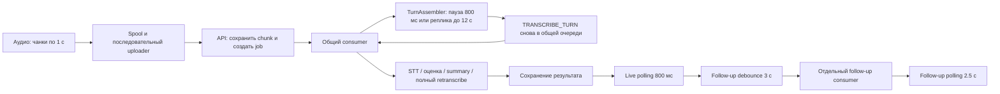

# Аудит задержек AI в Nebula

Дата: 2026-09-11. Проверена текущая рабочая копия, включая незакоммиченные изменения
adaptive follow-ups. Код приложения в рамках аудита не менялся.

Ощущение «всё по очереди» имеет конкретную причину: основная очередь действительно
обрабатывается последовательно. Кроме этого, в новом пути follow-ups найдены ошибки,
которые способны превращать успешный ответ в повторный запрос или мешать самому запуску.
Смена модели сама по себе эти проблемы не исправит.

План для реализации: [ai-latency-implementation-plan.md](ai-latency-implementation-plan.md).

## Граница доказательств

- Анализ Desktop → Tauri capture/uploader → API → repository → worker → adapters.
- Read-only SQL по агрегатам стандартной `data/nebula.db`, снимок около 14:39 UTC.
  Содержимое интервью, аудио, ключи и тексты ошибок из runtime DB в отчёт не включены.
- Пять локальных воспроизведений с временными SQLite DB и mock adapters; внешних запросов нет.
- 45 профильных тестов прошли. Это baseline, а не доказательство отсутствия найденных ошибок.
- Живой стек не перезапускался. Не установлено, что уже запущенный Python-процесс загрузил
  именно нынешнюю версию всех изменённых файлов. Наблюдения БД могут относиться к разным
  версиям за 9–11 сентября. Скорость провайдера и физические устройства не тестировались.

## Наблюдаемые задержки

Для завершённых jobs вычислено `(updated_at - created_at)`. На завершённой задаче это
приближение к времени «поставили → завершили», включая очередь, retries и выполнение.
Это не чистая latency STT/LLM; времени накопления аудио до enqueue здесь тоже нет.

| Тип | Завершённых | Среднее, с | Максимум, с |
| --- | ---: | ---: | ---: |
| TRANSCRIBE_AUDIO | 225 | 8.81 | 75.88 |
| TRANSCRIBE_TURN | 18 | 47.24 | 188.70 |
| EVALUATE_QUESTION | 16 | 17.77 | 85.45 |
| BATCH_RETRANSCRIBE | 2 | 37.26 | 73.97 |
| GENERATE_FOLLOWUPS | 1 | 21.78 | 21.78 |

В снимке также 12 FAILED оценок, 2 FAILED retranscribe и 1 FAILED follow-up. У обоих
follow-up jobs было по две попытки. Это маленькая историческая выборка; связывать каждую
ошибку с конкретным дефектом текущей версии нельзя. Незавершённых jobs в момент снимка нет.
Все 225 сохранённых chunks относятся к shared track, максимальная длительность — 1000 мс.

## Путь до результата



STT сейчас batch: профиль не поддерживает partials. Нельзя ожидать пословного появления
текста. После конца речи сборщик ждёт 800 мс тишины, затем доступность соответствующего
чанка, uploader, две стадии очереди и запрос STT. При непрерывной речи принудительный
разрез происходит около 12 секунд, плюс доставка чанка. Эти интервалы частично
перекрываются; складывать 12 секунд и всю длительность chunk как безусловный минимум неверно.
Источники: `backend/core/turn_assembler.py:25–28,387–409`, `backend/core/profiles.py:92–106`,
`apps/desktop/src-tauri/src/commands.rs:231–238,279–295`.

## Findings

### F1 · P1 · Основная очередь блокируется одним долгим запросом

`backend/workers/pipeline.py:1374–1406`: один `main_consumer` делает
`await process_one_job(exclude_types=["GENERATE_FOLLOWUPS"])`. В нём оказываются сборка
реплик, STT, оценка, summary и retranscribe. `async` освобождает event loop на время сети,
но следующий job этого consumer до завершения предыдущего не запускается.

`backend/db/repository.py:2034–2042` даёт recording-интервью приоритет только при следующем
claim. Уже начатый retranscribe остаётся впереди живого аудио, даже из другого интервью.
Внутри retranscribe каждый turn тоже ожидается последовательно
(`backend/workers/pipeline.py:871–920`). После каждого успешного job добавляется 300 мс
паузы; idle polling — 1 с. `max_concurrency=10` существует в профиле, но рабочий код его
не использует как лимитер или число consumers.

Воспроизведение: заблокировать mock handler оценки через `asyncio.Event`, поставить за
ним STT и follow-up. Follow-up начинается, STT — только после освобождения оценки.

Решение: ограниченные независимые consumers для assembly, live STT, оценки, follow-ups и
фоновой обработки. Перед этим выполнить F4: lease одного job не защищает все его записи.

### F2 · P0 · Успешный follow-up ответ имеет несовместимый формат

`backend/workers/pipeline.py:97–99,1297–1305` использует `OpenAICompatibleAdapter`,
но распаковывает ответ как `res_dict, model_used`. Реальный adapter возвращает словарь
с четырьмя ключами `data`, `raw_content`, `usage`, `model`
(`backend/adapters/llm.py:238–249`). Пару возвращает другой, resilient adapter.
Дополнительно валидатор follow-up должен получать содержимое `data`, а не envelope.

Воспроизведение реальной формы ответа mock-адаптером: `too many values to unpack
(expected 2)`, job возвращается в PENDING после одного успешного вызова. В существующем
наборе follow-up tests нет проверки целого пути handler → adapter response → persistence.

Решение: исправить извлечение `data` и metadata из текущего adapter contract, добавить
интеграционный тест через настоящий adapter с `httpx.MockTransport`.

### F3 · P0/P1 · Повторы стирают backoff и умножаются по нескольким уровням

Handler follow-up вызывает `fail_job` с `retry_delay_sec` либо `is_terminal=True`, затем
бросает исключение. Общий `process_one_job` снова вызывает `fail_job` без этих параметров
(`backend/workers/pipeline.py:187–206,1306–1326`). Repository допускает повторную запись,
когда `locked_by` уже NULL (`backend/db/repository.py:2210–2240`).

Два воспроизведения: transient error с запланированной задержкой 10 с заканчивается
`PENDING, locked_until=NULL`; терминальная auth error после первой попытки также
заканчивается PENDING. Это дефект, а не только неоптимальная настройка.

Оценка и summary дополнительно проходят цепочку: до 3 HTTP-попыток на модель × до 3
моделей × до 3 попыток job = до 27 HTTP-вызовов, если ошибки ведут по всем этим веткам.
При трёх 60-секундных read timeout на каждой модели одна job attempt может занимать
примерно `3 × (3 × 60 + 1 + 2) = 549 с`; три — около 27.5 минут. Это сценарный расчёт,
не измерение и не строгий верхний предел. HTTPX timeout задаётся по сетевым фазам,
а не на всю операцию ([документация HTTPX](https://www.python-httpx.org/advanced/timeouts/)).

Fallback ловит любые `Exception`, в том числе ошибки авторизации, и переключается
между моделями того же провайдера с тем же ключом (`backend/adapters/resilient_llm.py:49–117`).
Rate limit у основного пути возвращает job без durable delay и усыпляет consumer;
LLM adapter ограничивает Retry-After пятью секундами, даже если сервер просил больше.

Решение: один владелец перехода состояния job; классификация ошибок; durable retry с
соблюдением Retry-After; общий deadline и бюджет попыток на операцию; fallback только
для подходящих ошибок и в оставшемся бюджете. Не добавлять ещё один слой повторов.

### F4 · P1, до параллельности · Поздний STT пишет после потери lease

`_handle_transcribe_turn` получает owner token, но `add_transcript_segment` вызывается без
проверки lease и без зафиксированной revision (`backend/workers/pipeline.py:339–428`).
Repository выбирает активную revision в момент записи и делает upsert текста
(`backend/db/repository.py:388–443`). Проверка при `complete_job` происходит уже после записи.

Воспроизведение: во время mock STT заменить владельца job и active revision. Старый
worker сохраняет сегмент в новую revision, затем получает RepositoryConflictError
на завершении. Значит, отказ завершения не отменяет устаревшую запись.

Assembly cursor также обновляется без CAS по исходному cursor и без lease fence
(`backend/db/repository.py:2617–2692`); heartbeat игнорирует `False` от renew.
Это реальные ограничения для увеличения concurrency, а не утверждение, что текущие
задержки вызваны именно гонками.

Решение: атомарно проверять ownership, lifecycle и согласованность revision при записи;
задать явные правила для позднего live STT и ручных правок. Сборку одного
`(interview_id, track_id, capture_epoch)` сериализовать и защитить cursor от отката.

### F5 · P0/P1 · Polling способен бесконечно отодвигать автоматический follow-up

`apps/desktop/src/components/FollowUpSuggestions.tsx:76–112,129–208`:

1. Раз в 2500 мс новый response object записывается в `stateResponse`.
2. Этот object входит в dependencies `handleGenerate`.
3. `handleGenerate` входит в dependencies эффекта с 3000-мс debounce.
4. Каждый такой render отменяет и ставит timer заново, даже при неизменной речи.

При стабильных ответах polling чаще 3 с автозапуск может вообще не наступить.
Это вывод из dependencies; браузерное воспроизведение в рамках аудита не выполнялось.
Простое сокращение debounce маскирует причину и повышает число запросов.

Frontend fingerprint сейчас основан на всей речи кандидата, поэтому реплики другого
вопроса могут перезапускать эффект. Backend действительно отбирает контекст текущего
вопроса: это не доказательство отправки всей стенограммы провайдеру.

Сервер также использует outcome `failed`, а API проверяет `outcome == "error"` при
формировании статуса (`backend/api/app.py:1410–1415`). UI не переводит
`latest_request.job.status/error_message` в error state. Retry bar есть, но его показ
зависит от локального `errorMessage`, который polling при terminal failure не заполняет.

Решение: timer от стабильного fingerprint текущего вопроса; согласованный статус job;
видимые ошибка и повтор; polling без overlap и без сброса timer от неизменного контекста.

### F6 · P1 · UI завершает ожидание по косвенным признакам

- Live quick evaluation выключает кнопку лишь до ответа enqueue; повторные клики создают
  новые jobs (`LiveSessionScreen.tsx:251–277`, `services/api.ts`, `repository.py:1968–1990`).
- Review ставит вопросы через последовательные POST, но backend может начать обработку
  уже во время enqueue. Это не дополнительная полная последовательность AI-вызовов.
- Review проверяет `proposals.length >= questions.length` либо 30 тиков. Старые/stale
  proposals способны преждевременно завершить ожидание; при позднем результате polling
  уже остановлен (`ReviewScreen.tsx:808–865`). Нет надёжного учёта именно запрошенных jobs.
- Live загружает весь interview snapshot каждые 800 мс без in-flight guard. Ответы могут
  прийти в обратном порядке и перезаписать более свежие данные
  (`LiveSessionScreen.tsx:113–133`, `backend/api/app.py:663–701`).
- Stop делает 120 последовательных итераций с двумя await и sleep 500 мс. Это
  `120 × (0.5 с + progress + readiness)`, а не гарантированные 60 секунд
  (`LiveSessionScreen.tsx:195–237`). Работа backend после UI timeout продолжается.

Решение: показывать очередь/выполнение/повтор/готовность/ошибку конкретных jobs;
дедуплицировать оценку одного актуального контекста на сервере; устойчивый polling;
разделить окончание записи и готовность данных к review, сохранив readiness gate.

### F7 · P2 · Доставка аудио имеет отдельный последовательный участок

`apps/desktop/src-tauri/src/uploader.rs:159–190,229–253`: tracks обходятся по порядку,
каждый POST ожидается. Для dual_source при 1-секундных чанках поступает 2 jobs/s;
если средний POST дольше 500 мс, очередь растёт даже без учёта сканирования spool и sleeps.
При 600 мс теоретическая capacity около 1.67 chunks/s. Это условный расчёт; в наблюдаемой
БД использовался только shared track, POST timing не измерялся.

Hex увеличивает PCM payload примерно вдвое. Uploader перечитывает/сортирует metadata
spool, capture выполняет fsync данных и metadata. Это издержки, но их вклад в минуты
ожидания не доказан. Не менять транспорт и durability до измерений.

`SessionUploader::stop` отдаёт JoinHandle в timeout 10 с и при timeout теряет handle;
`get_upload_progress` может создать background uploader для того же backlog
(`uploader.rs:369–374`, `commands.rs:609–642`). Возможность наложения final drain и нового
uploader следует из кода; реальный stop с задержанной сетью нужно воспроизвести.

Решение после основной очереди: сохранить одного владельца uploader на session,
fairness между tracks; при подтверждённом backlog — до двух upload lanes с порядком
внутри track. ACK, checksum, epoch и повторная доставка сохраняются.

### F8 · Продуктовое ограничение · Shared unknown требует решения человека

В single_source речь по умолчанию unknown. Пока человек не подтвердил candidate role,
её нельзя использовать как evidence оценки или follow-ups. Весь наблюдаемый audio
набор был shared; это может объяснять часть случаев «AI молчит», но состояние ручной
разметки не исследовалось. Такой случай UI должен отличать от очереди и ошибки провайдера.
Нельзя ускорять приложение автоматическим превращением unknown в candidate.

## Приоритет решения

1. Исправить F2/F3/F5, добавить тесты реального пути и явные ошибки в UI.
2. Добавить время ожидания/выполнения/провайдера по attempts, затем F4 и разделение очередей F1.
3. Исправить отслеживание jobs и дубликаты F6. После этого измерять новый baseline.
4. Оптимизировать uploader, размер контекста, polling payload и аудиозадержку по данным.
5. Streaming STT — отдельная продуктовая работа только при требовании текста во время
   произнесения фразы и после проверки конкретного provider/profile.

Не нужны на первом этапе Redis/Celery, смена БД, массовое размножение процессов или
новый провайдер. Повторное использование `httpx.AsyncClient` полезно для connection pool,
но само по себе не устраняет F1–F6 ([документация HTTPX](https://www.python-httpx.org/async/)).
Синтетическая сборка 1/12/60 секунд тишины на этой машине заняла около 2/25/128 мс:
CPU сборщика не доказан как основная причина наблюдаемых минут ожидания. Обработка
длинного backlog всё же синхронна и требует контроля event-loop lag.

## Выполненные проверки

```bash
uv run pytest -q tests/test_pipeline_worker.py tests/test_turn_assembler.py \
  tests/test_turn_assembler_repository.py tests/test_followup_questions.py \
  tests/test_followup_repository.py tests/test_followup_api.py \
  tests/test_llm_adapter.py tests/test_stt_adapter.py
```

Результат: 45 passed, два deprecation warnings FastAPI/Starlette test client.
Отдельные временные Python-сценарии подтвердили serial consumer, несовместимый формат
follow-up ответа, потерю retry delay, отмену terminal failure и позднюю запись STT.
Для каждого использовалась новая временная БД и mock provider, без runtime mutations.
В реализации эти сценарии должны стать постоянными regression tests.

Полный pytest, Rust/build, browser/Tauri UI, hardware capture и provider probe для
документационного аудита не запускались. Требования к ним перечислены в плане реализации.
