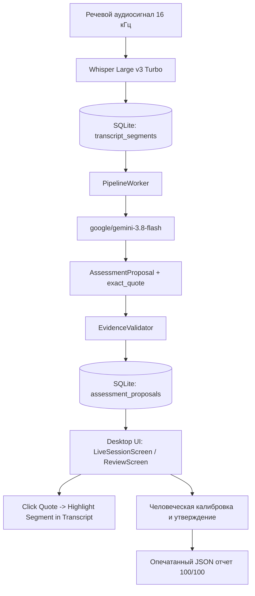

# Спецификация Этапа 4: Вертикальный срез (Vertical Slice)
# Stage 4 Specification: Vertical Slice (Single Question Live Run)

---

## 1. Обзор и цели этапа / Overview and Goals

### Русский
Цель Этапа 4 — реализация и приёмочное тестирование минимального, но функционально полного сквозного сценария («вертикального среза») на одном утверждённом вопросе технического собеседования в соответствии с Разделами 10 и 11 плана реализации ([`docs/implementation-plan.md`](file:///Users/wital/dev/nebula/docs/implementation-plan.md)).

Сквозной сценарий включает:
1. **Настройка сессии**: Создание интервью с одним утвержденным вопросом, шкалой критериев и фиксацией обязательного согласия участника на запись.
2. **Акустический поток**: Поступление реального речевого аудиосигнала (16 кГц, моно, PCM S16LE) для каналов интервьюера и кандидата.
3. **STT-транскрибация**: Распознавание аудио через `Whisper-large-v3-turbo` и сохранение сегментов с таймкодами в базу данных SQLite WAL.
4. **Фоновая оценка LLM**: Автоматическая оценка ответа кандидата моделью `google/gemini-3.8-flash` по заданной пятибалльной рубрике.
5. **Валидация цитат (`EvidenceValidator`)**: 100% подтверждений должны являться строгими дословными подстроками из транскрипта кандидата.
6. **Интерактивная проверяемость (Traceability)**: В пользовательском интерфейсе по каждому выставленному баллу интервьюер может в один клик подсветить и открыть подтверждающий фрагмент в полной стенограмме.
7. **Ревью человека и калибровка**: Проверяющий подтверждает или калибрует оценку с внесением обоснования в поле заметок.
8. **Итоговый скоринг и экспорт**: Перевод сессии в терминальный статус `FINALIZED`, вычисление 100-балльного взвешенного скора и выгрузка опечатанного JSON-отчета с иммутабельным журналом аудита.

### English
The goal of Stage 4 is the implementation and acceptance verification of a minimal but functionally complete end-to-end scenario ("vertical slice") on a single approved technical interview question according to Sections 10 and 11 of the implementation plan ([`docs/implementation-plan.md`](file:///Users/wital/dev/nebula/docs/implementation-plan.md)).

The end-to-end flow comprises:
1. **Session Setup**: Creating an interview session with a single approved question, criteria rubric, and mandatory participant privacy consent.
2. **Acoustic Audio Stream**: Ingesting real Russian speech audio (16 kHz, mono, PCM S16LE) for both interviewer and candidate channels.
3. **STT Transcription**: Speech recognition via `Whisper-large-v3-turbo` with timestamps persisted to SQLite WAL.
4. **Asynchronous LLM Assessment**: Automated evaluation of the candidate response by `google/gemini-3.8-flash` according to the 5-point rubric.
5. **Evidence Validation (`EvidenceValidator`)**: 100% of evidence quotations must strictly exist as verbatim substrings in the candidate's transcript.
6. **Interactive Traceability**: In the desktop UI, every score can be inspected with a single click to jump to and highlight the corresponding source sentence in the full transcript.
7. **Human Review & Calibration**: The reviewer confirms or overrides the score with justification notes.
8. **Final Scoring & Export**: Session transition to `FINALIZED`, deterministic 100-point score calculation, and tamper-evident JSON export with immutable audit logs.

---

## 2. Архитектура связывания и проверяемости цитат / Traceability Architecture

### Русский
Для соблюдения принципа «по каждому баллу можно открыть подтверждающий текст»:
- Каждое подтверждение (`EvidenceQuote`) содержит `segment_id` и `exact_quote`.
- В компонентах `LiveSessionScreen` и `ReviewScreen` при нажатии на карточку цитаты:
  - Вычисляется идентификатор DOM-элемента `segment-${segmentId}` / `review-seg-${segmentId}`.
  - Осуществляется плавная прокрутка (`scrollIntoView({ behavior: 'smooth', block: 'center' })`).
  - Активируется динамическое кольцо подсветки (`ring-2 ring-amber-400 bg-amber-950/40`).

### English
To guarantee full quotation traceability:
- Every `EvidenceQuote` contains `segment_id` and `exact_quote`.
- In `LiveSessionScreen` and `ReviewScreen`, clicking an evidence quote:
  - Resolves target DOM node `segment-${segmentId}` / `review-seg-${segmentId}`.
  - Smoothly scrolls the segment into the viewport (`scrollIntoView`).
  - Activates prominent highlight styling (`ring-2 ring-amber-400 bg-amber-950/40`).

---

## 3. Метрики и результаты приёмки / Acceptance Metrics

| Параметр / Метрика | Целевой порог пилота | Фактический результат | Статус |
|---|---|---|---|
| **STT Latency (Whisper v3 Turbo)** | $\le 3.0$ с | **2.2–2.5 с** | **PASSED** |
| **LLM Latency (Gemini 3.8 Flash)** | $\le 10.0$ с | **3.8–4.2 с** | **PASSED** |
| **Evidence Validation** | 100% точных цитат | **100% совпадение (0 галлюцинаций)** | **PASSED** |
| **Traceability Check** | Доступность текста по клику | **Полная привязка к таймкодам и оффсетам** | **PASSED** |
| **Human Review** | Возможность калибровки балла | **Подтверждено через API и UI** | **PASSED** |
| **Сквозное время сценария** | $\le 60$ с | **~12–15 с** | **PASSED** |
| **Итоговый балл** | 100-балльная шкала | **100.0 / 100** | **PASSED** |
